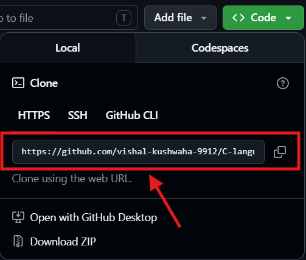
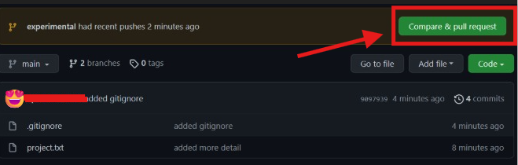
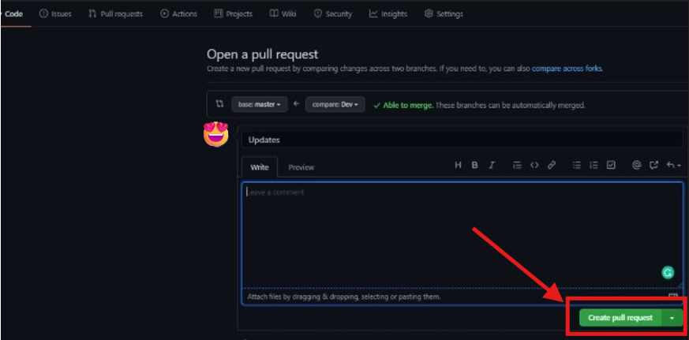

# how to contribute to a GitHub project!


## Quick Tips Before You Start

**Read the instructions first** - Most projects have a file called "CONTRIBUTING.md" or something in the README. Just skim it to see if they want things done a certain way.

**Start small** - Don't try to rewrite the whole project your first time. Fix a typo, add a comment, fix one small bug. Once you get the hang of it, you can do bigger stuff.

**Don't be scared** - Seriously, the worst that happens is they say "nah, not right now" and close your request. No big deal. Everyone starts somewhere.

**Check if anyone's already working on it** - Look at the "Issues" section to see if someone already reported the problem or if there's a discussion about it.

----


## Steps to Contribute to GitHub Projects:


## Step 1 : Create a GitHub Account

* Go to github.com
* Click "Sign up"
* Use any email address (Gmail, Outlook, Yahoo, or your own domain)
* Complete the verification process

---

## Step 2 : Fork the Repository

* Find the project (e.g., "appcode" repository)
* Click the "Fork" button in the top-right corner 


* This creates a copy of the project under your account


---

## step 3: Clone Your Fork Locally


* Go to your forked repository (you can find it in your GitHub profile)

* Click the green **"Code"** button


* Copy the HTTPS URL (or SSH if you prefer)





* Open your terminal/command prompt and run:


```bash
git clone https://github.com/YOUR-USERNAME/appcode.git
cd appcode
```


Replace `YOUR-USERNAME` with your actual GitHub username and `appcode` with the actual repository name.

---


## step 4 : Create a Branch for Your Changes

A branch keeps your changes separate from the main code. Create a new one:
 
```bash
git checkout -b your-feature-name
```

Use a descriptive name like:
* `fix-login-bug`
* `add-dark-mode`
* `update-documentation`


---


## Step 5 : Make Your Changes

* Edit files, add features, fix bugs, etc.

*  Follow the project's **contribution guidelines** (check `CONTRIBUTING.md` for code style, formatting rules, and conventions)

* Test your changes locally to ensure they work correctly

*  Don't change unrelated files — keep your contribution focused

---


## step 6 : Commit & Push

Save your work to github: 

```bash

* git add .
* git commit -m "Clear description of your changes"
* git push origin your-feature-name

```
**Tips for commit messages:**
* Be specific: ❌ "Fixed stuff" → ✅ "Fix login validation error on mobile"
* Use present tense: "Add feature" not "Added feature"
* Keep it concise (ideally under 50 characters)


---
 


## Step 7 : Create a Pull Request

* Go to the **original repository** (not your fonk)
* You'll see a notification about your recent push with a **"Compare & pull request"** button


* Click **"Pull requests"** → **"New pull request"**
* Add a title and description explaining:
   * What changes you made
   * Why you made them
   * How to test them (if applicable)

* Click **"Create Pull Request"***   



----


## What Happens Next?
 
* **Code Review** — Maintainers will review your changes and may ask for adjustments
* **Feedback** — Be open to suggestions and ready to make updates if needed
* **Approval** — Once approved, a maintainer will merge your changes into the main project
* **Celebration** — You've successfully contributed to open source! 🎉
---

## Troubleshooting
 
| Issue | Solution |
|-------|----------|
| "Permission denied (publickey)" | [Set up SSH keys](https://docs.github.com/en/authentication/connecting-to-github-with-ssh) or use HTTPS URLs |
| Changes won't push | Make sure you're on the correct branch (`git branch` to check) |
| Can't find "Fork" button | Ensure you're logged in and viewing the original repository |
| Pull request won't merge | Check if all status checks pass and there are no merge conflicts |
 
---

